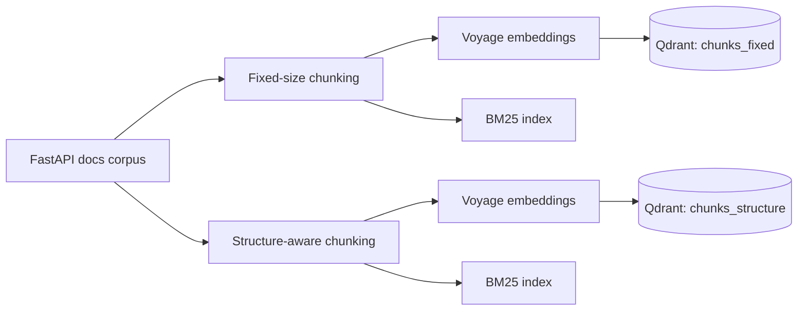
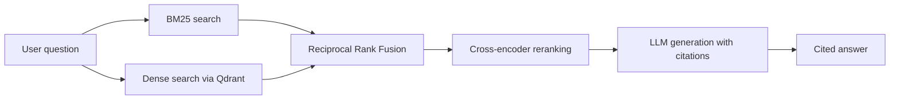

# Hybrid Retrieval RAG Pipeline

A retrieval-augmented generation (RAG) system built over FastAPI's documentation (154 pages). The goal was to measure retrieval quality directly, comparing chunking strategies and retrieval methods with real numbers instead of assuming a hybrid setup is automatically better.

## Architecture

**Indexing**, run once per chunking strategy:



**Query time**, run per question:



## What it does

- **Chunking**: two strategies, fixed-size (512 tokens, 50 overlap) and structure-aware (splits on markdown headers), so retrieval can be compared across both.
- **Indexing**: dense vectors in Qdrant (Voyage embeddings) plus a BM25 keyword index, built separately for each chunking strategy.
- **Retrieval**: three methods, BM25-only, dense-only, and hybrid via Reciprocal Rank Fusion.
- **Generation**: retrieved chunks are passed to an LLM with a prompt that requires every claim to cite its source chunk.
- **Eval**: 34 hand-written Q&A pairs with known-correct sources, scored with recall@5 across every method and both chunking strategies.

## What I found

Naive hybrid retrieval (equal-weight RRF) actually underperformed plain dense retrieval, 91% vs 100% recall@5. The reason turned out to be straightforward: RRF gives BM25 and dense an equal vote regardless of which one is actually more reliable for a given query. On one question, BM25 confidently matched a coincidental shared word ("custom") in a completely unrelated document, which pulled the correct answer out of the fused top-5 even though dense retrieval had ranked it correctly on its own.

| method | fixed chunks | structure chunks |
|---|---|---|
| BM25 only | 82% | 79% |
| dense only | 100% | 94% |
| hybrid (RRF, equal weight) | 91% | 91% |
| hybrid (RRF, dense weighted 2x) | 94% | 91% |
| **rerank (cross-encoder, after RRF)** | **100%** | **100%** |

Weighting dense more heavily recovered part of the gap. Adding a reranking stage closed it completely. A cross-encoder reads the query and each candidate chunk together, rather than combining two scores that were computed independently, so it can tell the difference between two passages that merely share a word and two passages that are actually about the same thing.

## Stack

Python, Qdrant (embedded, no Docker required), Voyage AI for embeddings and reranking, `rank_bm25` for keyword search, and Gemini for generation.

## Running it

```bash
pip install -r requirements.txt
cp .env.example .env   # add your API keys
python scripts/build_index.py   # builds both indexes, ~50 min on free-tier rate limits
python scripts/run_eval.py      # runs the full eval, ~70 min, same reason
```

Both scripts run slowly because every call is rate-limited to stay within Voyage's free tier (3 requests per minute without a billing method on file). `scripts/demo_retrieval.py` and `scripts/demo_generation.py` are faster ways to try the pipeline on a single query.
